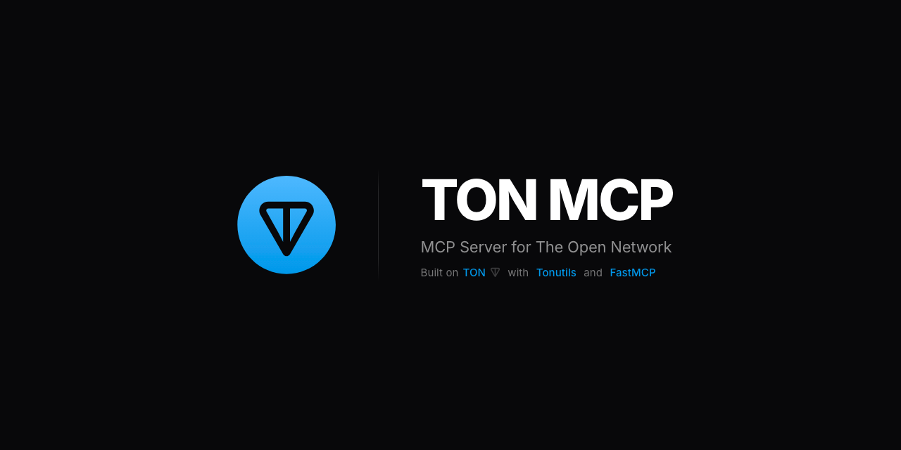

# 📦 TON MCP

[](https://ton.org)

[](https://pypi.python.org/pypi/ton-mcp)
[](LICENSE)
[](https://tonviewer.com/UQCZq3_Vd21-4y4m7Wc-ej9NFOhh_qvdfAkAYAOHoQ__Ness)




### MCP Server for [The Open Network](https://ton.org)

Interact with the TON blockchain via AI assistants.
Built on [Tonutils](https://github.com/nessshon/tonutils) and [FastMCP](https://github.com/jlowin/fastmcp).

> **Alpha version** — the project is under active development. APIs, tool names, and behavior
> may change in future releases. It is strongly recommended to test all operations on **testnet**
> before using on mainnet.

**Features**

- **Providers** — Lite Servers (ADNL), Toncenter & TonAPI (HTTP)
- **Networks** — mainnet, testnet, L2 (Tetra); auto tool filtering
- **Signing** — mnemonic, private key, or TonConnect
- **Wallets** — v3r1, v3r2, v4r1, v4r2, v5r1, highload_v3r1, preprocessed_v2
- **Transfers** — TON, jettons, NFTs, encrypted, gasless, batch
- **Jettons** — deploy, mint, burn, transfer admin, update metadata, lock
- **NFT** — standard, soulbound, editable; batch mint; SBT revoke/destroy
- **DNS** — resolve .ton/.t.me domains, set/delete wallet records
- **Queries** — wallet, contract, jetton, NFT, collection, DNS info

## Examples

Just ask your AI assistant:

```
"What's my wallet balance?"
"What wallet does ness.ton point to?"
"How many USDT do I have?"
"Send 1 TON to ness.ton with comment 'Thanks for ton-mcp!'"
"Send 0.1 TON with an encrypted message 'Hello from ton-mcp!'"
"Airdrop 0.1 TON to 50 wallets in one transaction"
```

**Multistep scenarios** — the AI will ask for details along the way:

```
Token launch → "Deploy a new token called MyToken"
  → asks for metadata URL, admin address
  → "Mint 1,000,000 tokens to my wallet"
  → "Airdrop 10,000 tokens to these addresses"
  → "Drop admin to lock supply forever"

NFT collection → "Create an NFT collection with 5% royalty"
  → asks for metadata URLs, royalty address
  → "Batch mint 10 items to different owners"
  → "Send 3 NFTs to these addresses"
```

## Quick Start

Install [uv](https://docs.astral.sh/uv/getting-started/installation/) (if not already installed):

```bash
curl -LsSf https://astral.sh/uv/install.sh | sh
```

Copy [`.env.example`](.env.example) to `.env` and configure [parameters](#parameters).

Add to your MCP client config (`.mcp.json`, `mcp.json`, or client settings):

```json
{
  "mcpServers": {
    "ton": {
      "command": "uvx",
      "args": [
        "--refresh",
        "ton-mcp"
      ],
      "env": {
        "ENV_FILE": "/path/to/.env"
      }
    }
  }
}
```

<details>
<summary><b>Running from source</b></summary>

```bash
git clone https://github.com/nessshon/ton-mcp.git
cd ton-mcp
uv sync
```

```json
{
  "mcpServers": {
    "ton": {
      "command": "uv",
      "args": [
        "run",
        "--directory",
        "/path/to/ton-mcp",
        "ton-mcp"
      ],
      "env": {
        "ENV_FILE": "/path/to/.env"
      }
    }
  }
}
```

</details>

## Configuration

### Networks

`NETWORK` (default: `testnet`)

- **mainnet** / **testnet** — all providers and tools.
- **tetra** — tonapi only, tonviewer only. No DNS, no gasless.

### Providers

`CLIENT_PROVIDER`

- **lite** — direct connection to Lite Servers. No API key needed. Custom config via `CLIENT_LITE_CONFIG`.
- **toncenter** — HTTP API. API key optional (improves rate limits).
- **tonapi** — required for gasless transfers. **API key required.**

### Signing

`WALLET_SECRET`

- **SECRET_KEY** — mnemonic or private key (hex/base64). Auto-signing, encrypted messages, gasless.
- **TONCONNECT** — leave empty. User approves each tx in wallet app (Tonkeeper, MyTonWallet, Tonhub, Telegram Wallet).

### Parameters

| Parameter                 | Default                                                                                                  | Description                                                                |
|---------------------------|----------------------------------------------------------------------------------------------------------|----------------------------------------------------------------------------|
| `NETWORK`                 | `testnet`                                                                                                | `mainnet`, `testnet`, `tetra`                                              |
| `EXPLORER`                | `tonviewer`                                                                                              | `tonviewer`, `tonscan`                                                     |
| `WALLET_VERSION`          | `v5r1`                                                                                                   | `v5r1`, `v4r2`, `v4r1`, `v3r2`, `v3r1`, `highload_v3r1`, `preprocessed_v2` |
| `WALLET_SECRET`           | —                                                                                                        | Mnemonic (space-separated) or private key (hex/base64)                     |
| `CLIENT_PROVIDER`         | —                                                                                                        | `lite`, `toncenter`, `tonapi`                                              |
| `CLIENT_API_KEY`          | —                                                                                                        | API key (required for `tonapi`, optional for `toncenter`)                  |
| `CLIENT_LITE_CONFIG`      | —                                                                                                        | Lite client config path or URL                                             |
| `CLIENT_RPS_LIMIT`        | `10`                                                                                                     | Requests per second limit                                                  |
| `CLIENT_RPS_PERIOD`       | `1.0`                                                                                                    | Rate limit window in seconds                                               |
| `TONCONNECT_MANIFEST_URL` | [manifest.json](https://raw.githubusercontent.com/nessshon/ton-mcp/main/assets/tonconnect-manifest.json) | Ton Connect manifest URL                                                   |
| `TONCONNECT_STORAGE_PATH` | `./tonconnect-storage.json`                                                                              | Ton Connect session storage path                                           |
| `TONCONNECT_APP_DOMAINS`  | `["github.com"]`                                                                                         | Domains for TonProof verification                                          |
| `TONCONNECT_SECRET`       | `ton-mcp-secret`                                                                                         | Secret for TonProof HMAC signing                                           |
| `MCP_SERVER_HOST`         | `127.0.0.1`                                                                                              | Server host (HTTP transport only)                                          |
| `MCP_SERVER_PORT`         | `0`                                                                                                      | Server port; `0` = auto-select (HTTP transport only)                       |

## See Also

**TON MCP** is built on [tonutils](https://github.com/nessshon/tonutils) and is part of a TON Python
ecosystem by the same author, which also includes [pytonapi](https://github.com/nessshon/pytonapi)
and [toncenter](https://github.com/nessshon/toncenter) (in development).
Future updates may bring Indexer API and DEX support as these libraries evolve.

## Contributing

This project is open to contributions, ideas, and suggestions.
Feel free to open an issue or submit a pull request.

## License

This repository is distributed under the [MIT License](LICENSE).
